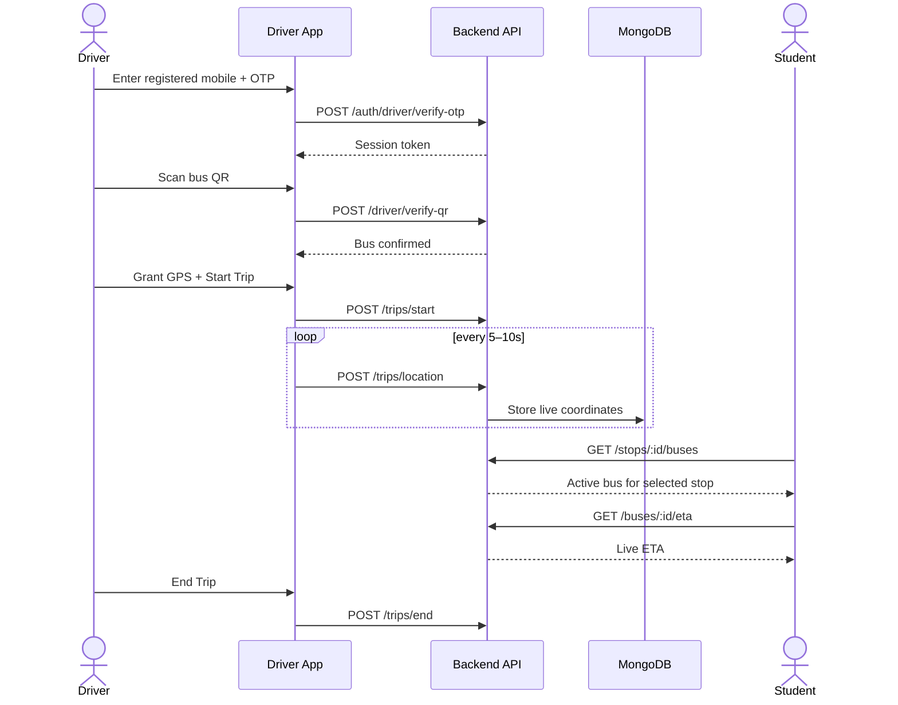
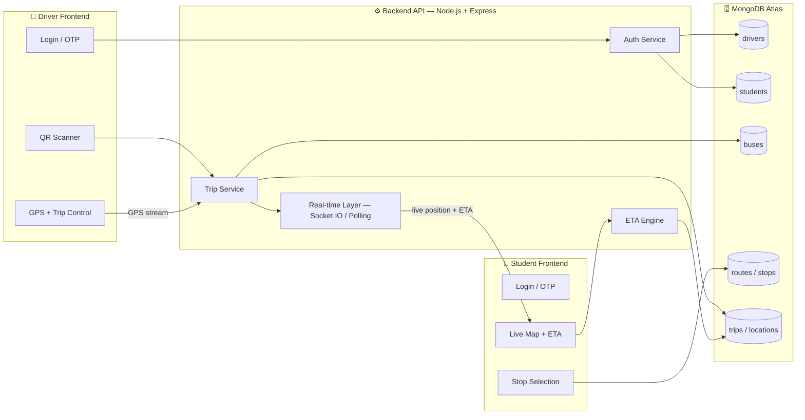

# React + Vite

This template provides a minimal setup to get React working in Vite with HMR and some ESLint rules.

Currently, two official plugins are available:

- [@vitejs/plugin-react](https://github.com/vitejs/vite-plugin-react/blob/main/packages/plugin-react) uses [Oxc](https://oxc.rs)
- [@vitejs/plugin-react-swc](https://github.com/vitejs/vite-plugin-react/blob/main/packages/plugin-react-swc) uses [SWC](https://swc.rs/)

## React Compiler

The React Compiler is not enabled on this template because of its impact on dev & build performances. To add it, see [this documentation](https://react.dev/learn/react-compiler/installation).

## Expanding the ESLint configuration

If you are developing a production application, we recommend using TypeScript with type-aware lint rules enabled. Check out the [TS template](https://github.com/vitejs/vite/tree/main/packages/create-vite/template-react-ts) for information on how to integrate TypeScript and [`typescript-eslint`](https://typescript-eslint.io) in your project.
<div align="center">


# 🚌 PSIT BusTrack

### Know your bus. Know your time.

Real-time college bus tracking & student ETA platform — built by a 6-member student team for the PSIT Technology Expo.

[](https://react.dev)
[](https://nodejs.org)
[](https://www.mongodb.com/atlas)
[](https://leafletjs.com)
[]()
[]()

[Overview](#-overview) · [Live Demo Flow](#-live-demo-flow) · [Architecture](#️-architecture) · [Team](#-team--work-division) · [Quick Start](#-quick-start) · [API](#-api-blueprint) · [Roadmap](#-roadmap)

</div>

---

## 📍 Overview

Campus bus timing is usually guesswork — a WhatsApp message, a phone call, or standing at a stop hoping. **PSIT BusTrack** turns every driver's phone into a live GPS source and gives each student a stop-specific, continuously refreshed arrival estimate.

| | |
|---|---|
| 🚍 **Driver** | Logs in with a registered number, scans the bus's QR code, grants GPS, starts the trip. |
| 🧑‍🎓 **Student** | Logs in, picks a boarding stop, sees the live bus on a map with ETA. |
| 🔐 **Security** | Server-verified driver↔bus assignment, short-lived sessions, no driver phone numbers ever exposed to students. |

> **Privacy principle:** location sharing is explicit and driver-controlled — it starts on *Start Trip* and stops on *End Trip*. Driver phone numbers are restricted operational data.

---

## 🎬 Live Demo Flow



---

## 🏗️ Architecture



---

## 👥 Team & Work Division

| Member | Ownership | Key Deliverables |
|---|---|---|
| **1 — Driver Frontend** | Login, QR scanner, GPS interface, driver dashboard | `driver-frontend/` |
| **2 — Student Frontend** | Login, stop selection, live map, ETA UI | `student-frontend/` |
| **3 — Backend** | APIs, database, auth, GPS processing, ETA service | `backend/` |
| **4 — Data: Buses & Drivers** | Bus/driver master records, assignments, QR tokens | `docs/data/buses-drivers.csv` |
| **5 — Data: Routes & Stops** | Routes, stops, coordinates, travel-time data | `docs/data/routes-stops.csv` |
| **6 — PPT, Testing & Integration** | End-to-end QA, bug tracking, expo demo, presentation | `docs/`, `tests/` |

**Workflow:** `Data Collection → Backend Database/API → Frontend Integration → Full Testing → PPT & Expo Demo`
Frontends start against **mock/seed data**; once Members 4 & 5 hand off verified data, it replaces the seed set with zero frontend code changes.

---

## 📁 Repository Structure

```
psit-bustrack/
├── driver-frontend/        # Member 1 — React + Vite driver app
├── student-frontend/       # Member 2 — React + Vite student app
├── backend/                # Member 3 — Express API + MongoDB models
├── docs/
│   ├── data/                # Member 4 & 5 — verified CSV datasets
│   ├── api-contract.md      # Frozen endpoint contract (source of truth)
│   └── architecture.md
├── scripts/                 # Seed data + QR token generator
├── tests/                   # Member 6 — API & integration tests
├── .env.example
└── README.md                # you are here
```

---

## 🚀 Quick Start

```bash
git clone https://github.com/<org>/psit-bustrack.git
cd psit-bustrack

# Backend
cd backend && npm install && npm run dev        # http://localhost:5000

# Driver app
cd ../driver-frontend && npm install && npm run dev   # http://localhost:5174

# Student app
cd ../student-frontend && npm install && npm run dev  # http://localhost:5173
```

Each frontend ships with `VITE_USE_MOCKS=true` in `.env.example`, so it runs and demos standalone before the backend is wired up — flip it to `false` once `VITE_API_BASE_URL` points at a live backend.

---

## 📡 API Blueprint

| Method | Endpoint | Purpose |
|---|---|---|
| `POST` | `/api/auth/driver/send-otp` | Start driver authentication |
| `POST` | `/api/auth/driver/verify-otp` | Verify driver, issue session |
| `POST` | `/api/auth/student/send-otp` | Start student authentication |
| `POST` | `/api/auth/student/verify-otp` | Verify student, issue session |
| `POST` | `/api/driver/verify-qr` | Validate QR against bus assignment |
| `POST` | `/api/trips/start` \| `/location` \| `/end` | Trip lifecycle + GPS ingestion |
| `GET`  | `/api/stops/:id/buses` | Active buses serving a stop |
| `GET`  | `/api/buses/:id/live` | Current live bus state |
| `GET`  | `/api/buses/:id/eta?stopId=` | ETA to a selected stop |

Full contract: [`docs/api-contract.md`](./docs/api-contract.md)

---

## ✅ Definition of Done

- [ ] Registered driver can authenticate; unregistered numbers are rejected
- [ ] Correct bus QR verifies; wrong QR is rejected
- [ ] Driver can grant GPS permission and stream live coordinates
- [ ] Driver can start and end an active trip
- [ ] Student can authenticate and select a valid boarding stop
- [ ] Correct active bus appears for the selected stop
- [ ] ETA calculates and refreshes as the bus moves
- [ ] No sensitive driver data (phone number) is ever exposed to students
- [ ] Critical flows pass end-to-end testing
- [ ] Final PPT covers problem, solution, architecture, USP and live demo

---

## 🗺️ Roadmap

| Status | Feature |
|---|---|
| ✅ | Core auth, QR verification, GPS streaming |
| ✅ | Stop-based tracking + live map |
| 🔜 | Smart ETA using historical route times |
| 🔜 | Geofencing for automatic arrival/departure detection |
| 🔜 | Route deviation alerts |
| 🔜 | Admin analytics dashboard |
| 🔜 | PWA for reliable background GPS |

---

<div align="center">

**PSIT BusTrack** — built for the PSIT Technology Expo · 2 Frontend + 1 Backend + 2 Data + 1 QA/PPT

</div>
